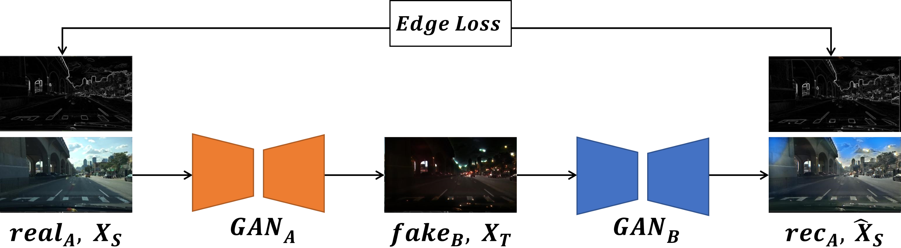
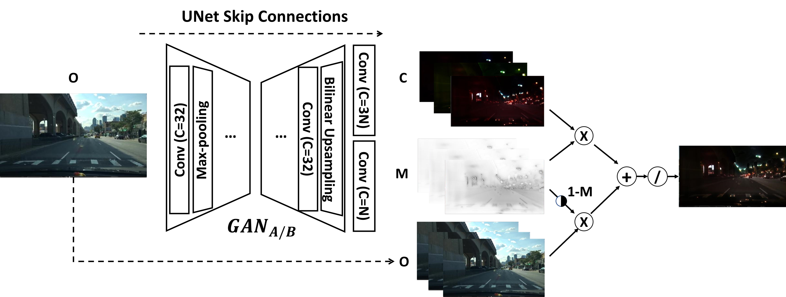

# CyEDA: Cycle-object Edge Consistency Domain Adaptation

### Official pytorch implementation of the paper: "CyEDA: Cycle-object Edge Consistency Domain Adaptation"

#### ICIP 2022 | [Paper](https://ieeexplore.ieee.org/document/9897493) 

## Results


## Architecture





## Environment
1. Clone this repository
   ```
   git clone https://github.com/bjc1999/CyEDA.git
   ```

2. Access the repository folder
   ```
   cd CyEDA
   ```

3. Create virtual environment **python 3.7 recommended**
   ```
   python -m virtualenv env
   ```

4. Activate the environment
   ```
   env/Scripts/activate
   ```

5. Install dependencies
   ```
   pip install -r requirement.txt
   ```

## Training
- Run `train.sh` script
  ```
  bash train.sh
  ```

- Execute `train.py` file within environment
  ```
  python train.py [--parameters]
  ```

## Testing
- Execute `predict.py` file within environment
  ```
  python predict.py [--parameters]
  ```

## Citation
If you find this work useful for your research, please cite
```bibtex
@INPROCEEDINGS{9897493,
  author = {Beh, Jing Chong and Woh Ng, Kam and Kew, Jie Long and Lin, Che-Tsung and Chan, Chee Seng and Lai, Shang-Hong and Zach, Christopher},
  booktitle = {2022 IEEE International Conference on Image Processing (ICIP)}, 
  title = {CyEDA: Cycle-Object Edge Consistency Domain Adaptation}, 
  year = {2022},
  pages = {2986-2990},
  doi = {10.1109/ICIP46576.2022.9897493}}
```

## Feedback
Suggestions and opinions on this work (both positive and negative) are greatly welcomed. Please contact the authors by sending an email to `cjbeh1999 at gmail.com` or `cs.chan at um.edu.my`.

## License and Copyright
The project is open source under BSD-3 license (see the `LICENSE` file).

©2023 Universiti Malaya.
